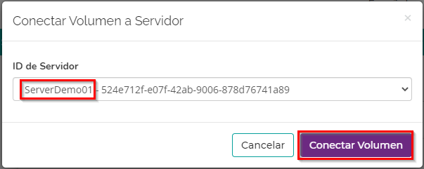
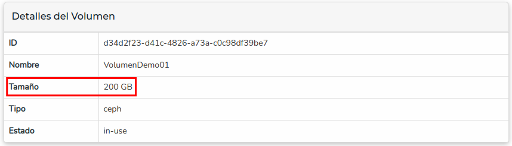

# Flexible Block Storage


Flexible Block Storage ([FBS](https://nubi2go.com/services/flexible_block_storage)) representa un servicio de volúmenes. Luego de crear uno o más volúmenes, podes conectarlos a una instancia o servidor. Los servidores corresponden a un producto Nubi Compute Service ([NCS](https://nubi2go.com/services/nubi_compute_service)). 
Debés tener, como mínimo, un NCS y un FBS contratados.

## Conectar FBS a una instancia

???+ warning "Nota"

	Podés conectar un volumen con una instancia a la vez


=== "Desde el servidor"

	1. Accedé al [Portal](https://portal.nubi2go.com)
	2. Seleccioná el ícono **“Servicios”**
	
	3. Elegí el servidor al cual querés conectar el volumen
	
	4. En la sección **“Volumenes”**, seleccioná el ícono **(+)**
	
	5. Elegí el volumen que querés conectar y seleccioná **“Conectar Volumen"**
	
	6. Listo. En la sección “Conexiones” vas a ver volumen que se conectó, el tamaño   
	y si contiene el Sistema Operativo
	

=== "Desde el volumen"

	1. Accedé al [Portal](https://portal.nubi2go.com)
	2. Seleccioná el ícono **“Servicios”**
	
	3. Elegí el volumen que querés conectar a un servidor
	
	4. En la sección **“Conexiones”**, seleccioná el ícono **(+)**
	
	5. Elegí el servidor que querés conectar y seleccioná **“Conectar Volumen”**
	
	6. Listo. En la sección “Conexiones” vas a ver el servidor al que se conectó y la   
	fecha
	

## Comprobar desde el sistema operativo
Luego de conectar el volumen, podés asegurarte desde el sistema operativo que la acción se haya completado correctamente. Chequealo así:

=== "En Linux - lsblk"
	``` sh
	lsblk
	```
	

=== "En Linux - fdisk -l"
	``` sh
	sudo fdisk -l
	```
	

=== "En Windows"
	1. Accedé por Escritorio Remoto o Consola
	2. Desde el buscador abrí la aplicación “Disk Management” o 
	“Administración de discos”
	
	3. Verificá que el disco aparezca
	

        
## ¿Cómo conectar el volumen en linux?
Después de conectar el volumen al servidor [desde el portal](#conectar-fbs-a-una-instancia), es necesario montarlo desde el sistema operativo para que el servidor lo pueda usar.

!!! note

	Esta guía indica cómo crear una partición, aplicarle formato y montar el volumen al servidor. Si el volumen YA TIENE DATOS (por ejemplo, estaba conectado a otro servidor), andá directamente al paso 6.


1. Anotá el identificador que le otorgó el sistema operativo, en este caso **/dev/vdb**:
```sh
lsblk
```


2. Ejecutá el programa **"fdisk"** con el identificador que anotaste en el paso anterior, en este caso **/dev/vdb**
```sh
sudo fdisk /dev/vdb
```


3. Poné **'n'** para crear una **n**ueva partición, luego recomendamos mantener todos los valores por defecto (podés apretar Enter y toma el valor indicado como default).


    !!! note
	    El último de los valores está relacionado con el tamaño de la partición, si dejás el valor por defecto va a particionar el disco completo.

4. Poné **'w'** para persistir (**w**rite) los cambios y salir


5. En este caso vamos a formatear con EXT4, pero podés usar el Filesystem que quieras. Corremos:
```sh
sudo mkfs -t ext4 /dev/vdb1
```


6. Elegí o creá un directorio donde montar el volumen. En este caso, creamos un directorio “/data”
```sh
sudo mkdir /data
```

7. Probá montar la partición en el directorio que recién creaste:
```sh
sudo mount /dev/vdb1 /data
```

    !!! note
	    El comando “mount” monta una partición en un directorio de manera temporal. Es decir, luego de un reinicio el volumen no estará montado. Es importante que sigas la guía hasta el final para montarlo definitivamente. 

8. Verificá poder escribir y leer un archivo en esa partición
```sh
sudo echo "probando" > /data/test.txt
sudo cat /data/test.txt
sudo rm /data/test.txt
```

9. Si no hay problemas, agregá una línea así en el archivo **/etc/fstab** con tu editor de texto favorito (nano, vi, vim, etc):

    /dev/vdb1      /data            ext4      defaults    0     1


10. Ya quedó montado el volumen definitivamente. El paso 9 asegura que se mantenga montado luego de un reinicio. 

## ¿Cómo conectar el volumen en Windows?
Después de conectar el volumen al servidor [desde el portal](#conectar-fbs-a-una-instancia), es necesario montarlo desde el sistema operativo para que el servidor lo pueda usar

1. En la barra de búsqueda escribi “Disk Management” o “Administración de discos” y abrí la aplicación

    

2. Ubicá tu nuevo volumen

    

3. Hacé botón derecho sobre el disco y ponelo "en línea" (online)
    

4. Hacé botón derecho sobre la sección negra que dice "Unallocated" y elegí "New Simple Volume"
    

5. Seguí el asistente, elegí todo el espacio del volumen, ponele el nombre que quieras y finalizá

6. Listo, ya quedó montado definitivamente. Probá desde el explorador de archivos poder escribir y leer sobre el volumen
    

## Extensión
Los volúmenes se pueden extender en cualquier momento según se requiera.

1. En la sección **"Acciones del Volumen"** seleccioná **"Extender"**
   
2. Elegí el nuevo tamaño y seleccioná **"Extender"**
   
3. Una vez que se termine de ejecutar la acción, en la sección **"Detalles del Volumen"** vas a ver el nuevo tamaño.
   