# Object Storage Service


Object Storage Service ([OSS](https://nubi2go.com/services/object_storage_service)) representa un servicio de almacenamiento de objetos compatible con S3. Luego de crear un usuario de S3 con sus credenciales, podés crear buckets, guardar tus archivos e integrarlo con tus aplicaciones.

## S3 Endpoint
Endpoint URL: <https://s3.nubi2go.com>

Bucket Access Style: Path Style (<https://s3.nubi2go.com/bucket-name>)

???+ warning "Nota"
	Por el momento no soportamos Virtual Hosted Access (<https://bucket-name.s3.nubi2go.com>)

## Obtener la Access Key y la Secret Key
1. Accedé al [Portal](https://portal.nubi2go.com)
2. Seleccioná [Object Storage Service](https://portal.nubi2go.com/object-storage-service.php)
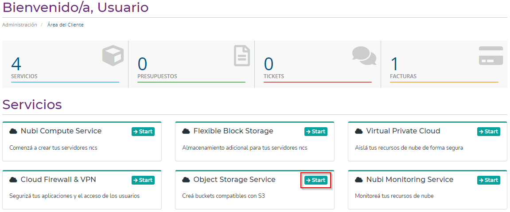
3. Obtené las keys
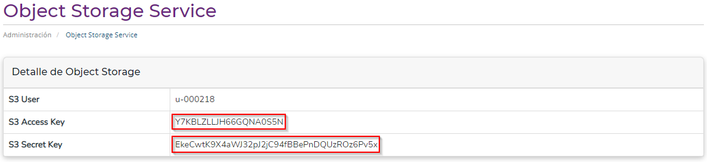

## Instalar el AWS CLI
=== "En Linux"
	``` sh
	curl "https://awscli.amazonaws.com/awscli-exe-linux-x86_64.zip" -o "awscli.zip"
	unzip awscli.zip
	./aws/install
	```

=== "En Windows"
	Descargá y corré el AWS CLI MSI  para Windows (64-bit): <https://awscli.amazonaws.com/AWSCLIV2.msi>

	O

	Abrí un CMD como administrador y corré el siguiente comando:
	``` bat
	msiexec.exe /i https://awscli.amazonaws.com/AWSCLIV2.msi
	```

## Configurar el AWS CLI
En Linux utilizar la terminal bash y en Windows abrir un CMD. Corré:
``` sh
aws configure
```
Y poné las keys:

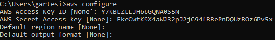

## Operaciones básicas con AWS CLI
1. Crear un bucket con nombre “bucket-demo”
``` sh
aws --endpoint-url=https://s3.nubi2go.com s3api create-bucket --bucket bucket-demo
```
2. Listar los buckets 
``` sh
aws --endpoint-url=https://s3.nubi2go.com s3 ls
```
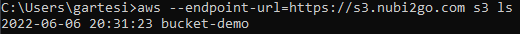
3. Subir un archivo con nombre “demo.txt” al bucket “bucket-demo” bajo el nombre “prueba.txt” 
``` sh
aws --endpoint-url=https://s3.nubi2go.com s3 cp demo.txt s3://bucket-demo/prueba.txt
```
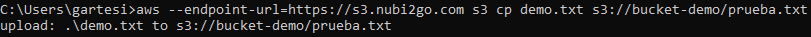
4. Para imprimir el contenido del objeto "prueba.txt" por pantalla 
``` sh
aws --endpoint-url=https://s3.nubi2go.com s3 cp s3://bucket-demo/prueba.txt -
```
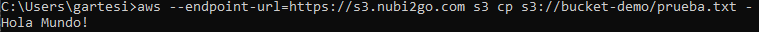

5. Subir un archivo en una carpeta llamada “folder”
``` sh
aws --endpoint-url=https://s3.nubi2go.com s3 cp demo.txt s3://bucket-demo/folder/prueba2.txt 
```


	!!! note
		El concepto de carpeta tiene el fin de organizar y agrupar los objetos, simplificando las operaciones al momento de integrarlo en nuestras aplicaciones. 


6. Listar los objetos del bucket “bucket-demo”
``` sh
aws --endpoint-url=https://s3.nubi2go.com s3 ls bucket-demo
```
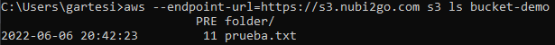
7. Listar los objetos dentro de la carpeta “folder”
``` sh
aws --endpoint-url=https://s3.nubi2go.com s3 ls bucket-demo/folder/
```
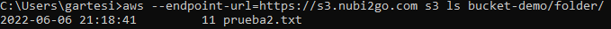
8. Hacer público el objeto "prueba2.txt"
``` sh
aws --endpoint-url=https://s3.nubi2go.com s3api put-object-acl --bucket bucket-demo --key folder/prueba2.txt --acl public-read
```
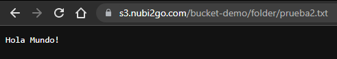
9. Borrar el objeto "prueba.txt"
``` sh
aws --endpoint-url=https://s3.nubi2go.com s3 rm s3://bucket-demo/prueba.txt
```
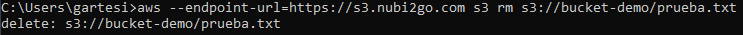

## Operaciones recursivas con AWS CLI
1. Subir todo el contenido de la carpeta “local-folder” a una nueva carpeta “folder-demo”
``` sh
aws --endpoint-url=https://s3.nubi2go.com s3 cp --recursive local-folder s3://bucket-demo/folder-demo/
```
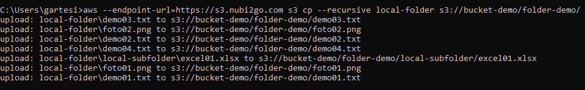
2. Listar el contenido del bucket, sus carpetas y subcarpetas
``` sh
aws --endpoint-url=https://s3.nubi2go.com s3 ls -–recursive bucket-demo
```
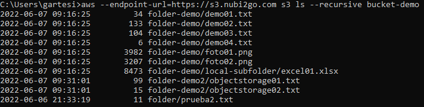
3. Borrar todos los objetos de la carpeta “folder-demo2” 
``` sh
aws --endpoint-url=https://s3.nubi2go.com s3 rm –-recursive s3://bucket-demo/folder-demo2 
```
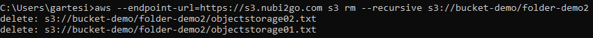
## Integraciones en el código
=== "Python - boto3"
	1. Instalá el paquete con PIP
	``` sh
	pip install boto3
	```
	2. Construí el cliente
	``` python
	import boto3

	access_key = "Y7KBLZLLJH66GQNA0S5N"
	secret_key = "EkeCwtK9X4aWJ32pJ2jC94fBBePnDQUzROz6Pv5x"
	n2g_endpoint = "https://s3.nubi2go.com/"

	s3_client = boto3.client(
		's3',
		aws_access_key_id = access_key,
		aws_secret_access_key = secret_key,
		endpoint_url = n2g_endpoint
	)
	```
=== ".NET - minio"
	1. Instalá el paquete con Nuget Package Manager Console.
	``` sh
	PM> Install-Package Minio
	```
	2. Construí el cliente
	``` csharp
	using Minio;

	private static MinioClient GetMinioClient()
	{
            var n2gEndpoint = "s3.nubi2go.com";
            var accessKey = "Y7KBLZLLJH66GQNA0S5N";
            var secretKey = "EkeCwtK9X4aWJ32pJ2jC94fBBePnDQUzROz6Pv5x";

            return new MinioClient().WithEndpoint(n2gEndpoint)
                                    .WithCredentials(accessKey, secretKey)
                                    .WithSSL()
                                    .Build();
	}
	```
=== "PHP - AWS SDK"
	1. Instalá las dependencias
		* Opción 1: Composer (recomendada)
	``` sh
	composer require aws/aws-sdk-php
	```
		* Opción 2: [ZIP File](https://docs.aws.amazon.com/aws-sdk-php/v3/download/aws.zip)
	``` php
	<?php
	require '/path/to/aws-autoloader.php';
	```
	2. Construí el cliente
	``` php
	<?php
	use Aws\S3\S3Client;

	define('ACCESS_KEY', 'Y7KBLZLLJH66GQNA0S5N');
	define('SECRET_KEY', 'EkeCwtK9X4aWJ32pJ2jC94fBBePnDQUzROz6Pv5x');
	define('N2G_ENDPOINT', 'https://s3.nubi2go.com');

	require __DIR__.'/vendor/autoload.php';

	$s3_client = new S3Client([
               'region' => '',
               'version' => '2006-03-01',
               'endpoint' => N2G_ENDPOINT,
               'credentials' => [
                    'key' => ACCESS_KEY,
                    'secret' => SECRET_KEY
               ],
               // Set the S3 class to use s3.nubi2go.com/bucket-name
               'use_path_style_endpoint' => true
	]);
	```
=== "Java - minio"
	1. Instalá las dependencias
		* Maven
	``` xml
	<dependency>
	    <groupId>io.minio</groupId>
	    <artifactId>minio</artifactId>
	    <version>8.4.1</version>
	</dependency>
	```
		* Gradle
	``` json
	dependencies {
	   implementation("io.minio:minio:8.4.1")
	}
	```
	2. Descargá la última versión del JAR (<https://repo1.maven.org/maven2/io/minio/minio/>)
	3. Construí el cliente
	``` java
	import io.minio.MinioClient;

	MinioClient s3_client =
           MinioClient.builder()
           .endpoint("https://s3.nubi2go.com")
           .credentials("Y7KBLZLLJH66GQNA0S5N", "EkeCwtK9X4aWJ32pJ2jC94fBBePnDQUzROz6Pv5x")
           .build();
	```
